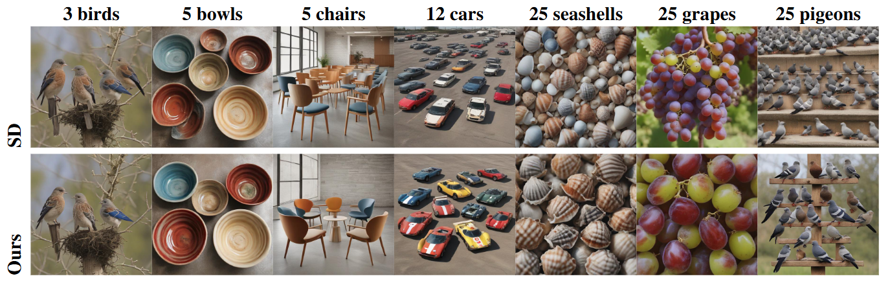
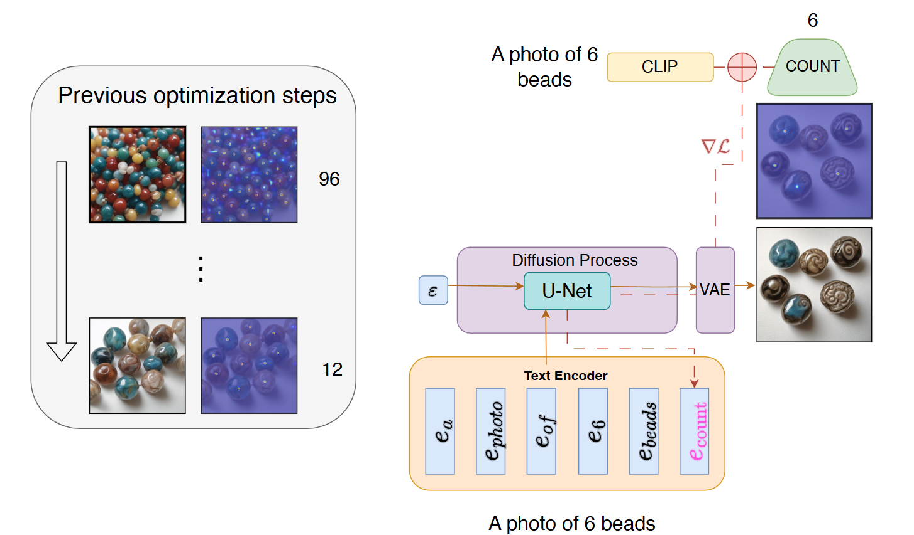

# Objects Count Optimization for Text-to-image Diffusion Models

This repository contains the code related to our paper *Objects Count Optimization for Text-to-image Diffusion Models*.

> Oz Zafar\*1, Idan Schwartz\*1, Lior Wolf1
> 1Tel Aviv University
> \* Denotes equal contribution
>
> We address a persistent challenge in text-to-image models: accurately generating a
specified number of objects. Current models, which learn from image-text pairs,
inherently struggle with this task due to the impossibility of finding an image for
every number. We propose a novel technique that iteratively modifies the text
conditioning and generates images, adjusting the number of objects via a counting
loss, which is derived from the aggregation of attention map peaks. Our method
offers three key advantages: (i) it is a zero-shot method requiring no additional
training; (ii) it is a plug-and-play solution facilitating rapid changes to the counting
and SD method; and (iii) it provides fine-grained user control. Through assessments
of the generation of various objects, we demonstrate that our approach significantly
enhances accuracy.
>

 
We propose a technique that introduces a token ($S_c$) corresponding to an external target label count $c$. This improves text-to-image alignment to the prompt in the aspect of targeted number of objects.

## TODO:
- []  

## Installations:

#### Hugging face

Run this command to log in with your HF Hub token if you haven't before:

`huggingface-cli login`

#### Create conda environment

`conda env create -f requirements.yml`

`conda activate objects_count_optimization`

#### Dependencies

must:

`TODO - CLIP-COUNT`

optional:

`TODO - YOLO`

`TODO - DINO`

## Run and Evaluate:

 
An overview of our method for optimizing a new discriminative token representation ($v_c$) using a pre-trained object detection model. For the prompt `A photo of a $S_c$ 6 beads,' we expect the output generated with the count $c$ to be 6. The object detection model, however, indicates that the amount of beads in the generated image is a lot bigger. We generate images iteratively and optimize the token representation using MSE loss. Once $v_c$ has been trained, more images of the target amount can be generated by including it in the context of the input text.

To train and evaluate use:
`python run.py --clazz beads --amount 6 --train True  --evaluate True`

#### Hyperparameters:
The hyperparameters can be changed in the `config.py` script. Note that the paper results are based on [SDXL-turbo](https://huggingface.co/stabilityai/sdxl-turbo).

#### Outputs
The script will create folders and store tokens representation in `token` and the images in `img`.

## Citation

If you make use of our work, please cite our paper:

TODO